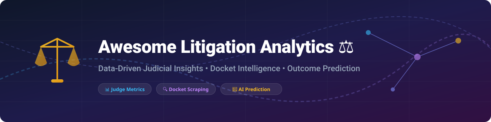

  

# ⚖️ Awesome Litigation Analytics: Judicial, Docket & Legal Market Intelligence 🚀

  
  
  
  

A curated list of **Litigation Analytics SaaS Platforms** 💼, **Legal Tech Market Intelligence** 📈, and **Open-Source Court Data GitHub Repositories** 🌐. 

This ecosystem directory helps litigators ⚖️, legal operations leads 📑, data scientists 🔬, and legal tech researchers analyze judges 👨‍⚖️, opposing counsel 🤝, case outcome prediction models 🔮, motion success rates 📊, damages trends 💵, timing metrics ⏱️, and venue strategy 🏛️.

---

## 📌 Table of Contents
- [📊 Market Overview & Ecosystem Dynamics](#-market-overview--ecosystem-dynamics)
- [💼 SaaS & Commercial Platforms](#-saas--commercial-platforms)
- [💻 Open-Source GitHub Projects](#-open-source-github-projects)
- [🎯 Key Features & Use Cases](#-key-features--use-cases)
- [💖 Support & Sponsorship](#-support--sponsorship)
- [📈 Star History](#-star-history)
- [🤝 How to Contribute](#-how-to-contribute)
- [⚠️ Disclaimer](#%EF%B8%8F-disclaimer)

---

## 📊 Market Overview & Ecosystem Dynamics

The global legal analytics and litigation intelligence market is estimated at **$3.15 Billion to $3.64 Billion (2025–2026)** 🌐 and is projected to expand rapidly driven by judicial AI adoption 🤖, automated docket ingestion ⚡, and predictive outcome modeling 🔮. 

**Market Structure:** The commercial litigation analytics sector is **highly concentrated and dominated by major legal publishing incumbents** 🏛️ (such as Thomson Reuters and LexisNexis / RELX), alongside select venture-backed software providers. Because obtaining, cleaning, and normalizing multi-jurisdictional court dockets and judge histories requires heavy engineering infrastructure ⚙️, top-tier commercial platforms operate largely as consolidated enterprise suites, while open-source projects power foundational data pipelines and research frameworks 🛠️.

---

## 💼 SaaS & Commercial Platforms

The table below lists leading commercial litigation analytics software platforms, ranked by **Company Size & Revenue Tier** (descending) 📉.

| Platform 🌐 | Description 📝 | Specific Starting Price 🏷️ | Free Tier / Trial Details 🎁 | Company Size / Revenue Tier 🏢 |
| :--- | :--- | :--- | :--- | :--- |
| **[Westlaw Litigation Analytics](https://legal.thomsonreuters.com/)** | Enterprise judicial & attorney analytics embedded in Westlaw Edge/Precision covering judges, law firms, damage trends, and case types. | $105/month (base Westlaw plan add-on; enterprise contracts vary) | 7-Day Free Trial (requires business verification) | **Parent: Thomson Reuters ($6.8B+ annual revenue)** 🏆 |
| **[Lex Machina](https://lexmachina.com/)** | Category-defining analytics for judge behavior, opposing counsel, motion success rates, and patent/IP outcomes across federal & state courts. | $5,000/year (starting package per user/small group) | 14-Day Free Demo / Trial (upon sales evaluation) | **Parent: RELX / LexisNexis ($3.5B+ Legal division revenue)** 💎 |
| **[Lexis CourtLink](https://www.lexisnexis.com/)** | Comprehensive docket searching, tracking, and court document analytics integrated into LexisNexis research. | $150/month (base access subscription) | 7-Day Free Trial (via LexisNexis enterprise trial) | **Parent: RELX / LexisNexis ($3.5B+ Legal division revenue)** 💎 |
| **[Fastcase Analytics](https://www.fastcase.com/)** | Legal research and litigation analytics platform integrated with vLex and widely distributed through bar associations. | $65/month (standalone basic tier; often free via bar memberships) | Free forever basic access via participating state/local Bar Associations | **Parent: vLex ($100M+ revenue post-merger)** 🚀 |
| **[UniCourt](https://unicourt.com/)** | Enterprise court data API and docket research platform delivering standardized dockets, alerts, and legal analytics. | $99/month (Standard Individual Tier; API packages higher) | 14-Day Free Trial (with initial search credits) | **Mid-Market ($10M–$25M estimated revenue)** 🌟 |
| **[Docket Alarm](https://www.docketalarm.com/)** | Fast docket tracking, PTAB/TTAB analytics, motion outcome research, and court document search platform. | $39.99/month (Pay-As-You-Go; $99/mo Flat-Fee unlimited) | 14-Day Free Trial (includes 10 free document views) | **Acquired by Fastcase/vLex ($10M–$20M division tier)** ⚡ |
| **[Gavelytics](https://www.gavelytics.com/)** | State court judicial analytics engine evaluating judge motion rulings and litigation patterns. | $250/month (historical standalone entry rate) | 7-Day Free Trial (pre-acquisition baseline) | **Acquired by Pre/Dicta ($5M–$10M valuation tier)** 📈 |
| **[Solomonic](https://www.solomonic.co.uk/)** | Premier UK litigation intelligence platform providing data-driven analytics for High Court and commercial proceedings. | £250/month (~$325/mo starting seat rate) | 7-Day Custom Demo / Managed Trial | **Growth Startup ($2.5M+ total venture funding)** 🇬🇧 |
| **[Premonition](https://premonition.ai/)** | Global litigation database analyzing attorney win rates, judge decision durations, and risk performance benchmarking. | $500/month (Entry single-user access tier) | 7-Day Managed Demo / Sample Analytics Report | **Venture-Backed ($2M–$5M estimated revenue)** 💡 |
| **[Trex AI](https://www.trex.ai/)** | Emerging AI-powered legal intelligence platform providing automated case analytics and litigation workflow automation. | $199/month (Pro user starting plan) | 14-Day Free Trial (full platform feature access) | **Early Stage ($1M–$3M estimated funding/revenue)** 🤖 |

---

## 💻 Open-Source GitHub Projects

Open-source litigation analytics repositories provide the foundation for public court data mining ⛏️, citation extraction 📚, docket scraping 🔍, and judicial data processing ⚙️. Below is a curated list ranked by **GitHub Star Count** (descending) 🌟.

| Project & Repository 🛠️ | Star Count ⭐️ | Description 📝 | Primary Use Case 🎯 |
| :--- | :--- | :--- | :--- |
| **[CourtListener](https://github.com/freelawproject/courtlistener)** |  | Fully searchable open archive of U.S. court opinions, dockets, oral arguments, RECAP filings, and judicial disclosures. | Court Data Infrastructure & Search 🏛️ |
| **[x-ray](https://github.com/freelawproject/x-ray)** |  | Open-source redactor inspection tool that identifies bad or incomplete PDF redactions in legal documents. | PDF Redaction & Security Audit 🛡️ |
| **[Juriscraper](https://github.com/freelawproject/juriscraper)** |  | Scraping framework for extracting metadata and opinions from federal and state court websites across the U.S. | Legal Data Ingestion & Scraping ⚡ |
| **[Eyecite](https://github.com/freelawproject/eyecite)** |  | High-performance Python library for extracting, parsing, and normalizing legal citations from unformatted text. | Citation Extraction & Linkage 📖 |
| **[Reporters-DB](https://github.com/freelawproject/reporters-db)** |  | Structured database mapping regional and historical legal reporters, abbreviations, and citation volumes. | Citation Standardizing 🗂️ |
| **[Doctor microservice](https://github.com/freelawproject/doctor)** |  | Microservice converting complex legal documents (PDF, Word, Word Perfect) into clean text, HTML, and OCR data. | Document Conversion & OCR 📄 |
| **[Courts-DB](https://github.com/freelawproject/courts-db)** |  | Database of historical and active U.S. federal and state courts used for jurisdiction lookup and data enrichment. | Court Metadata Taxonomy 🔍 |
| **[RECAP Chrome Extension](https://github.com/freelawproject/recap-chrome)** |  | Browser extension feeding public federal PACER filings into the open RECAP Archive hosted on CourtListener. | PACER Crowdsourcing 🔓 |
| **[Cap-Examples](https://github.com/harvard-lil/cap-examples)** |  | Code examples, notebooks, and research scripts for utilizing the Harvard Law School Caselaw Access Project corpus. | Academic Legal NLP Research 🎓 |
| **[PyTorch LJP](https://github.com/PolarisRisingWar/pytorch_ljp)** |  | Open-source PyTorch implementation of deep learning models for Legal Judgment Prediction (LJP). | Judgment Prediction ML 🤖 |
| **[Free Law Project Tools & APIs](https://free.law/)** |  | Python API client libraries and REST tools for querying CourtListener opinions, dockets, and judge profiles. | Court Data Integration 🔌 |

---

## 🎯 Key Features & Use Cases

- **👨‍⚖️ Judge Analytics:** Analyze historical motion grant rates, average time to disposition, and ruling tendencies across specific causes of action.
- **🤝 Counsel Benchmarking:** Compare opposing counsel's win/loss records, settlement behavior, and typical litigation pacing.
- **🔔 Docket Intelligence & Tracking:** Monitor real-time filings across federal (PACER) and state jurisdictions with automated alerts.
- **🏛️ Venue Strategy & Forum Selection:** Evaluate district-level patent, commercial, or tort outcomes to select optimal filing venues.

---

## 💖 Support & Sponsorship

Thank you for visiting and supporting this curated resource! If you find this litigation analytics directory helpful for your research, legal operations, or practice, please consider:

- ⭐ **Starring** this repository on GitHub to increase visibility.
- 🔄 **Forking** and sharing with your legal tech network or colleagues.
- ☕ **Buying a coffee** to sponsor ongoing curation and maintenance via the [GitHub Sponsor Dashboard](https://github.com/sponsors/ishandutta2007).

Your support keeps legal data accessible, transparent, and community-driven! 🙌

---

## 📈 Star History

---

## 🤝 How to Contribute

1. Fork this repository.
2. Update `README.md` following the standard tabular format.
3. Ensure all SaaS entries include explicit starting prices, free tier/trial specs, and company scale metrics.
4. For open-source tools, include valid GitHub star badges linking directly to `stargazers`.
5. Submit a Pull Request with a short summary of changes.

---

## ⚠️ Disclaimer

This repository is community-curated for informational and research purposes. Litigation analytics represent historical and probabilistic trends and do not guarantee future legal outcomes. All legal decisions should be made in consultation with qualified counsel.

---

<i>Maintained with ❤️ for legal operations teams, litigators, and legal technology researchers.</i>

